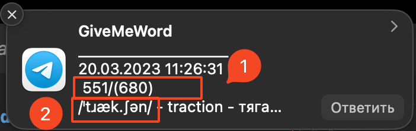
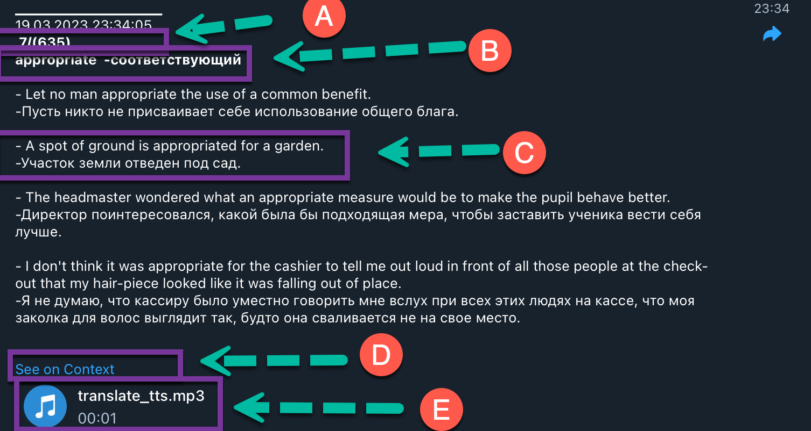
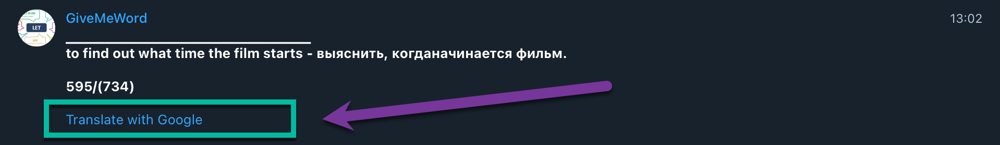

# giveMeWord


## Telegram bot for sending your card with translation, pronunciation, examples and link to all meanings

# At the moment giveMeWord bot can :

-   send messages with the required timer,
-   the words from the dictionary are output absolutely randomly.

## 1.Push notifications :


<!--  -->

-   original line with transcription of the foreign word

 <br>

## 2.Full version of Message (one word):



-   A - if necessary the number of the element from the dictionary and the number of the whole dictionary is displayed
-   B - line original with transcription
-   C - show found examples (if there are any for this word)
-   C - translation of examples!!! ( with the support of a third-party service)
-   D - if it is a single word, you will find a link to Reverso Context ( https://context.reverso.net ) for further information
-   E - giving voice to the word by a native speaker (if the word is absent in the voice database then the voice is produced by an artificial text)

<br>
 
## 3.Full version of Message (few words):


<!--  -->

-   if it is more than one word you will find a link to google-translate.

# Installation instructions :

### create .env file in main folder with need contain :

## ##yandex translate

-   PRIVATE_KEY=
-   OAUTH_TOKEN=
-   SERVICE_ACCOUNT_ID =
-   KEY_ID =

## ##telegram bot

-   TELEGRAM_BOT_TOKEN=
-   CHAT_ID_ADMIN =
-   folder_id =

1. in main folder, text in the terminal `npm install`
2. `npm run start` - start of the project
3. `npm run dev` - start of the project in dev mode (limit and period another)
4. `npm run dev-debug` - start of the project in dev-debug mode
5. `npm run prod` - start of the project in prod mode

# How to Contribute to Open Source:

## Forking a Project :

```bash
git clone https://github.com/yair-roshal/000-giveMeWordBot.git
```

Once you're done making changes, you can upload the updated files back to GitHub using the command
`git push origin master`

## Keeping Track of Upstream :

If you'd like to keep track of the upstream project (the one that you forked to create your own), then you'll need to add what's called an additional remote. This is basically just another keyword you can use while you're inside your application's folder. To create the new remote, run the command

```bash
git remote add upstream https://github.com/yair-roshal/000-giveMeWordBot.git
```

## Merging Upstream Changes :

If you notice that the upstream project has been updated and you'd like to incorporate the changes, you can run

```bash
git pull upstream
```

after creating the additional remote, and GitHub will download and merge changes from upstream into your project's files. If everything works perfectly after running that command, you can immediately run

```bash
git push origin master
```

to push the updates to your own project.

## If there are difficulties go to :

https://www.freecodecamp.org/news/how-to-contribute-to-open-source-projects-beginner

## This project used :

-   "axios": "^1.3.3",
-   "dotenv": "^16.0.3",
-   "express": "^4.18.2",
-   "fs": "^0.0.1-security",
-   "fs-extra": "^11.1.0",
-   "jsonwebtoken": "^9.0.0",
-   "langdetect": "^0.2.1",
-   "lodash": "^4.17.21",
-   "node-jose": "^2.1.1",
-   "node-telegram-bot-api": "^0.61.0",
-   "nodemon": "^2.0.3",
-   "path": "^0.12.7",
-   "pm2": "^5.2.2"
