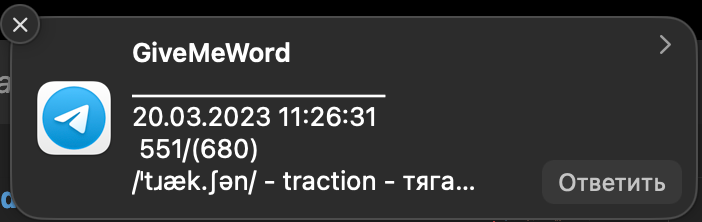
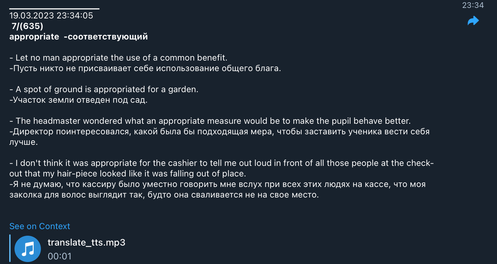

# giveMeWord - Telegram Bot For sending your card with Translation, pronunciation, examples and link to all meanings

#### Notifications :

<!--  -->

### Full version of Message :

<!--  -->

# How to Contribute to Open Source:

## Forking a Project :

`git clone https://github.com/yair-roshal/000-giveMeWordBot.git`

Once you're done making changes, you can upload the updated files back to GitHub using the command
`git push origin master`

## Keeping Track of Upstream :

If you'd like to keep track of the upstream project (the one that you forked to create your own), then you'll need to add what's called an additional remote. This is basically just another keyword you can use while you're inside your application's folder. To create the new remote, run the command

`git remote add upstream https://github.com/yair-roshal/000-giveMeWordBot.git`

## Merging Upstream Changes

If you notice that the upstream project has been updated and you'd like to incorporate the changes, you can run

`git pull upstream` after creating the additional remote, and GitHub will download and merge changes from upstream into your project's files. If everything works perfectly after running that command, you can immediately run

`git push origin master` to push the updates to your own project.

## If there are difficulties go to

https://www.freecodecamp.org/news/how-to-contribute-to-open-source-projects-beginner

## Installation instructions

1. in main folder, text in the terminal `npm install`
2. `npm run start` - start of the project
3. `npm run dev` - start of the project in dev mode
4. `npm run dev-debug` - start of the project in dev-debug mode
5. `npm run prod` - start of the project in prod mode

## This project used

1. Node
1. TelegramBot for Node
